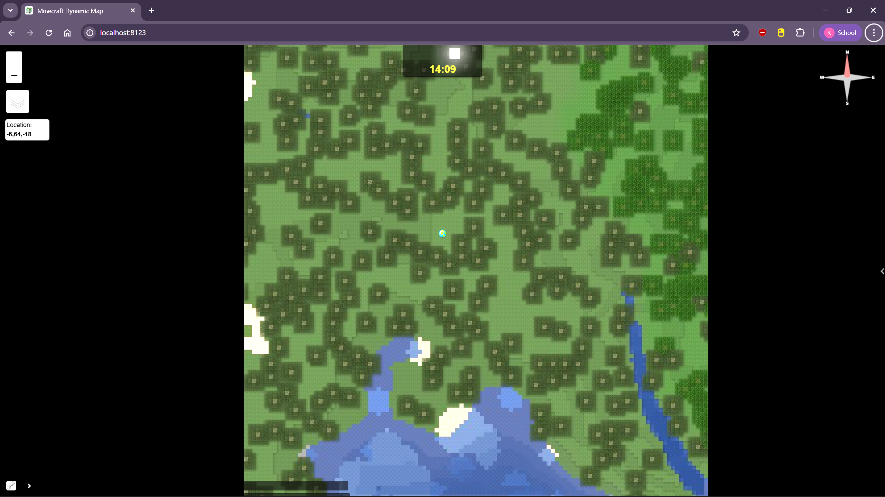
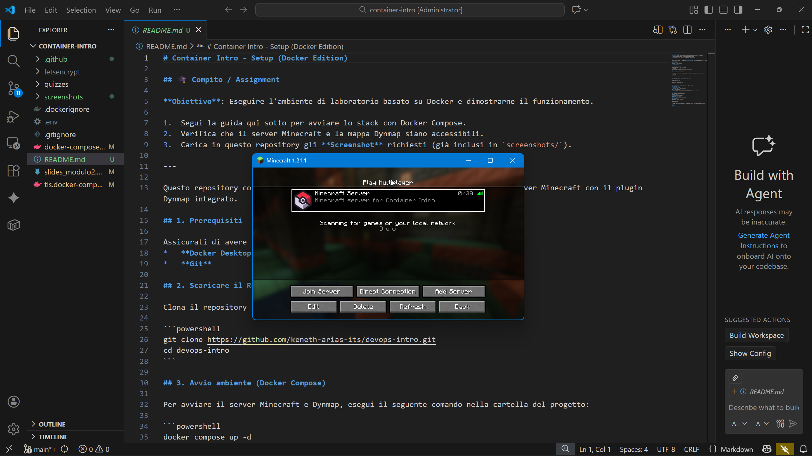

# Container Intro - Setup (Docker Edition)

## 🎓 Compito / Assignment

**Obiettivo**: Eseguire l'ambiente di laboratorio basato su Docker e dimostrarne il funzionamento.

1.  Segui la guida qui sotto per avviare lo stack con Docker Compose.
2.  Verifica che la mappa Dynmap e il server Minecraft siano accessibili.
3.  Carica in questo repository gli **Screenshot** richiesti (come quelli in `screenshots/`).

---

Questo repository contiene la configurazione **Docker Compose** per avviare un server Minecraft con il plugin Dynmap integrato.

## 1. Prerequisiti

Assicurati di avere installato:
*   **Docker Desktop**
*   **Git**
*   **Warp**

## 2. Scaricare il Repository

Clona il repository (se non l'hai già fatto):

```powershell
git clone https://github.com/keneth-arias-its/container-intro.git
cd container-intro

```

## 3. Avvio ambiente (Docker Compose)

### ⚠️ Importante: Fix DNS
Prima di avviare, esegui questo script per installare Cloudflare Warp e prevenire errori di connessione (es. download falliti):

```powershell
.\warp.ps1
```

### Avvio del server MC
Per avviare il server Minecraft e Dynmap, esegui il seguente comando nella cartella del progetto:

```powershell
docker compose up -d
```

Questo scaricherà l'immagine del server e avvierà il container `mc`.

### Verificare lo stato
Puoi controllare i log per vedere come il server si avvia:

```powershell
docker compose logs -f mc
```

Quando è pronto dovresti vedere un output simile a questo:
``` sh
[Server thread/INFO]: Starting remote control listener
[Server thread/INFO]: Thread RCON Listener started
[Server thread/INFO]: RCON running on 0.0.0.0:25575
[Server thread/INFO]: [Dynmap] Loaded 3 maps of world 'devops'.
[Server thread/INFO]: [Dynmap] Loaded 2 maps of world 'DIM-1'.
[Server thread/INFO]: [Dynmap] Loaded 2 maps of world 'DIM1'.
```

Premi `Ctrl+C` per uscire dai log.

## 4. Accesso alle Applicazioni

Una volta avviato, i servizi sono accessibili ai seguenti indirizzi:

### 🗺️ Dynmap (Mappa Web)
*   **URL**: [http://localhost:8123](http://localhost:8123)
*   Visualizza la mappa del mondo di gioco in tempo reale direttamente dal browser.

### 🎮 Minecraft Server
*   **Indirizzo Server**:

    ```localhost:25565```

*   **Versione**:

    ```1.21.1```

*   Collegati usando il tuo client Minecraft oppure [Prism Launcher](https://drive.google.com/file/d/1HR2peQHitM-adWNL2kizO0nOXd1zyCeq/view?usp=sharing).

## 5. Dimostrazione (Screenshots)

Ecco come si vede l'ambiente funzionante:

### Dynmap Webpage


### Minecraft Server Status


Carica 2 screenshot simili a quelli mostrati in questo repository.

## 6. Spegnimento

Per fermare e rimuovere i container:

```powershell
docker compose down
```

I dati del mondo di gioco sono salvati nel volume Docker `data`, quindi non verranno persi al riavvio.

---
## Licenza
Distribuito sotto licenza MIT.